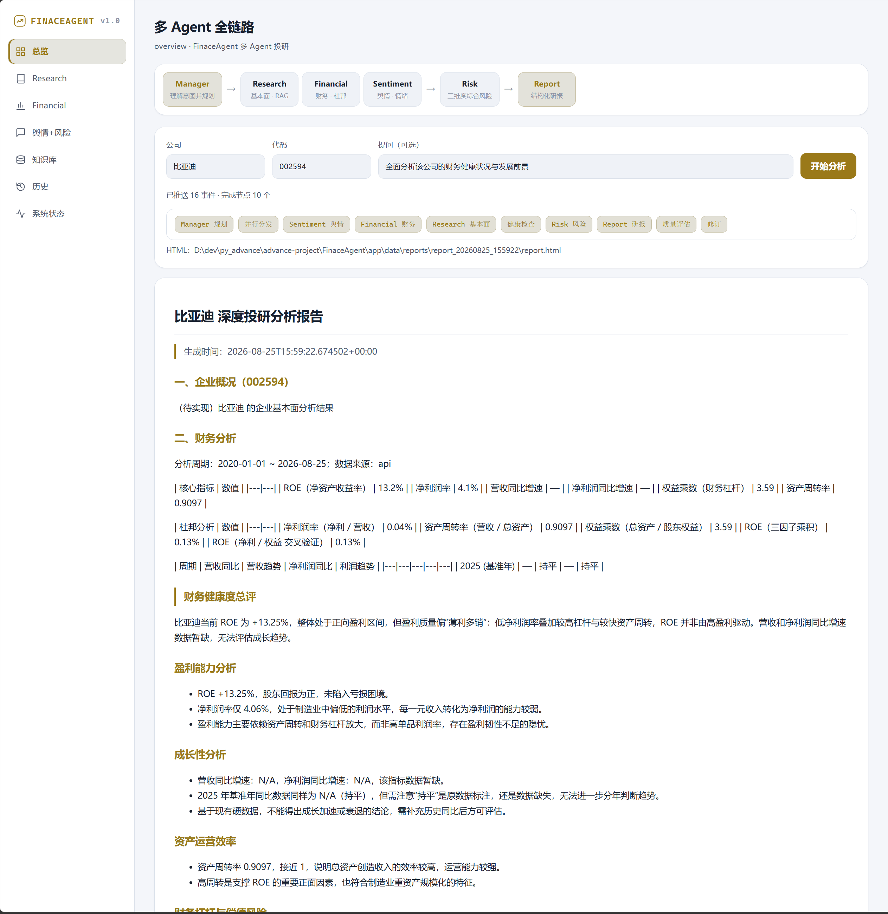

# FinaceAgent · 多 Agent 金融智能分析平台

> **[English](README.en.md)｜中文**
>
> 一套用 **LLM + LangGraph + RAG + 真实金融数据 + 中文情感模型 + React 前端**驱动的多 Agent 投研流水线。输入目标公司，自动产出六章结构化研报。

---

## 功能与流程演示

一键端到端投研流水线：**Manager 意图规划 → 并行（Research RAG ∥ Financial 指标硬算 ∥ Sentiment 新闻情感）→ 健康检查重试环 → Risk 三维评估 → Report 六章组装 → 质量迭代环 → 研报输出**（Markdown / HTML 双导出 + SSE 实时节点进度）。

下图为一键生成 **比亚迪（002594）** 深度研报的实机运行（多 Agent 全链路视图）：

- **流程可视化**：左轨 5-Agent 流程（Manager → 并行 3 路 → Risk → Report）；SSE 节点流水逐节点暴露进度（Manager 领取 → 并行分发 → 舆情 / 财务 / 基本面 → 健康检查 → 风险 → 撰写 → 质量评估 → 修订，本次 **10 个成功节点**）。
- **结构化输出**：下方即生成结果，完整六章研报，支持 Markdown / HTML 导出。



**最新示例报告**（生成时间 2026-08-25T15:59:22 · 路径 `app/data/reports/report_20260825_155922/report.md`）：

| 章节 | 核心内容 | 数据来源 |
|---|---|---|
| 一、企业概况 | 002594 · 比亚迪 | RAG 知识库 |
| 二、财务分析 | ROE 13.2% · 净利率 4.1% · 权益乘数 3.59 · 资产周转率 0.9097 · 杜邦三因子 · 盈利/成长/运营/杠杆分项 | 结构化 API（Pandas 硬算） |
| 三、行业与竞争力 | —（数据待补充） | RAG |
| 四、舆情风向 | 抓取 10 条新闻 · 看多 9 / 看空 1 / 中立 0 | 新闻检索 + 中文情感 |
| 五、风险评估 | 综合 **LOW**（评分 0.060 / 1.0）· 三维度推理链（舆情 0.15 / 财务 0.0 / 行业 0.0） | 规则定级 + 推理 |
| 六、投资建议 | 综合风险较低，可作重点研究对象 + 免责声明 | 全链路 |

---

## 1. 为什么做（The Problem）

传统投研流程 = **资料收集 → 人工阅读 → 数据整理 → 量化分析 → 风险判断 → 撰写报告**，存在三个结构性痛点：

1. **信息来源分散**：财报、公告、新闻、行业数据散落各处，人工检索耗时。
2. **时效滞后**：行情、舆情要求实时，人工跟踪跟不上。
3. **重复劳动 + 易错**：指标计算、格式整理高度重复；人工计算易错，且"计算"与"解释"混在一起，难以审计。

FinaceAgent 的目标不是"一个更聪明的聊天机器人"，而是**用多个各司其职的 Agent 复刻一个真实投研团队**——把可自动化的环节（检索、计算、抽提、归因）交给程序，把需要判断的环节（解读、权衡、定级）交给模型，并全程**可审计、可降级、可复用**。

---

## 2. 设计理念（Design Philosophy）

### 2.1 Agent 职责单一 —— 真实团队映射
系统把线下分工映射为 **Manager 调度 + 5 个专业 Agent**。**一个 Agent 只做一件事**，禁止跨领域复制能力（架构不可变规则）：

| Agent | 职责 | 数据来源 |
|---|---|---|
| Manager | 意图理解、规划、调度 | LLM |
| Research | 基本面 / 行业 | RAG 知识库 |
| Financial | 财务指标计算 | 结构化 API |
| Sentiment | 新闻舆情 + 情感 | 新闻检索 + NLP |
| Risk | 三维度综合评估 | 上游三路信号 |
| Report | 研报生成 | 全部上游输出 |

### 2.2 数据分类施策 —— 结构化走 Tool，非结构化走 RAG
**拒绝"全量灌 RAG"**。按数据特性分层：

```
结构化数据(指标/行情) → Tool + 硬计算（Pandas）
非结构化知识(年报/政策) → RAG（切块→嵌入→检索→归因）
时效数据(新闻舆情) → 实时检索 + 情感分类
```

### 2.3 计算与解释严格分离（根除数值幻觉）
**"模型只负责解释，不负责计算"**。ROE、杜邦、同比等指标由 `quant_engine` 用 Pandas 硬算；LLM 只拿到计算结果做专业解读。这条原则把"数值错误"从模型侧彻底排除。

### 2.4 抗幻觉 —— Evidence 归因（Research Agent）
报告生成采用**证据索引归因**：LLM 只返回论点引用的**证据编号**（`evidence_refs`），真实 `source / 页码 / quote` 由后处理从 `ref_map` 补全。越界索引被静默丢弃；无证据的论点保留但在报告中明确标注"证据为空"。**引用无法被模型捏造**。

### 2.5 确定性 vs 智能的平衡 —— 逐层解耦
- **确定性层**：ReportAssembler **确定性组装**六章（zero-parse / zero-dependency），LLM 只负责在少数环节润色。
- **智能层**：Node / 意图 / 规划交给 LLM。
- **失控防护**：所有循环都带**轮次上限**（健康检查重试环 ≤2、报告质量迭代环 ≤3、RAG 自适应 ≤3 轮），上限即唯一强制出口，防死循环与成本失控。

### 2.6 容错优先 —— 每 Agent 有降级路径
- Research：真实 RAG 不可用（无入库 / 模型加载失败）→ 优雅降级占位，**绝不中断主链**。
- Financial：akshare 失败 → 本地 fixture → 空。
- Sentiment：新闻接口失败 → 占位；模型不可用 → 中性。
- Risk：数据缺失 → 规则定级。
- 健康检查环识别不健康节点并重试。

### 2.7 可观测 & 复用
- **可观测**：SSE 全链路逐节点进度、系统就绪状态（DB/Milvus/模型/数据源逐项）。
- **复用**：每个 Agent 历史自动持久化；综合报告生成**自动复用最新历史**，避免重复劳动。

---

## 3. 架构思维（Architecture）

### 3.1 整体拓扑 —— 一条"规划 → 并行 → 汇聚 → 渐进精化"的主链路

```
                    ┌──────────────┐
                    │  Manager      │  意图理解 / 任务规划
                    └──────┬───────┘
                           │ intent_router  ← 条件分支 (full_research / clarify)
               ┌───────────┼───────────┐  Send API fan-out（真正并行）
               ▼           ▼           ▼
        ┌──────────┐ ┌──────────┐ ┌──────────┐
        │ Research │ │Financial │ │Sentiment │
        │ (RAG)    │ │ (akshare)│ │ (新闻+NLP)│
        └────┬─────┘ └────┬─────┘ └────┬─────┘
             └────────────┼────────────┘   ← gather
                          ▼
                 ┌──────────────┐  ┌─ 环1 健康检查重试环 (≤2, 只重发失败节点)
                 │ health_check │──┘
                 └──────┬───────┘   → risk（全健康 / 重试耗尽，节点内降级）
                        ▼
                 ┌──────────────┐
                 │   Risk       │  三维度综合评估
                 └──────┬───────┘
                        ▼
                 ┌──────────────┐  ┌─ 环2 报告质量迭代环 (≤3, 追加修订)
                 │   Report     │──┘
                 └──────┬───────┘
                        ▼
                 evaluate_report → 研报 / clarify(信息不足追问)
```

### 3.2 关键架构决策（Architecture Decisions）

**AD-1：编排层用 LangGraph StateGraph + Send API，而非"串行管道"。**
三个 Agent（Research/Financial/Sentiment）通过 `Send` API **真正并行** fan-out → 汇聚；condition edges 承担意图分流与两个循环。这比"按顺序串行调 5 个函数"更贴近真实团队协作（并行提效），且 state 统一为 `TypedDict`（可追踪 / 可序列化 / 可恢复）。

**AD-2：数据层做 VectorStore 抽象，FAISS / Milvus 可切换。**
`app/rag/vectorstore/` 的 `get_store(company, backend)` 是唯一入口，`RAG_VECTOR_BACKEND` 配置切换。FAISS 用于本地 / 离线评测 / 紧急降级，Milvus 用于生产（`finance_agent.finance_knowledge`）。多公司通过 `company_id` 标量过滤隔离（AD-7），不默认分区。

**AD-3：可靠性 = "双循环 + 全链路降级"，而非单点 try/except。**
- **健康检查重试环**：并行 Agent 产出质量兜底，不健康节点**只重发失败者**（避免重复执行有副作用的行动），带轮次上限。
- **报告质量迭代环**：对最终报告做章节完整性 / 占位残留 / 长度评估，不达标追加修订。
- 每一环都有**唯一强制出口**（上限），保证有限收敛。

**AD-4：抗幻觉靠"证据索引归因"，而非"信任 LLM 输出"。**
Research Agent 的每条论点只存 `evidence_refs`（索引），真实来源由后处理从 ref_map 绑定——引用无法被模型伪造，可审计。

**AD-5：真实数据源 + 中文情感，拒绝"演示占位"。**
- 财务：akshare **EM 年报**（带交易所前缀，绝对元口径，取最新年报）。
- 新闻：akshare 东方财富 `stock_news_em`。
- 情感：**中文三分类模型**（多语言 distilled），避免英文 FinBERT 对中文全中性。

**AD-6：单入口 + 各 Agent 独立触发。**
`uvicorn app.main:app` 一个进程挂全部路由；每个 Agent 又有独立端点（Financial / Research / Sentiment / Risk / Knowledge / History / Report / SSE / 系统状态），既可独立运作，也可一键全链路——兼顾"专家单模块调试"与"端到端跑通"。

**AD-7：GPU 感知。**
BGE-M3 与 reranker 均自动探测 CUDA（`RAG_EMBEDDING_DEVICE=auto`）；BGE 转 **fp16** 减半显存，8GB 卡也能 BGE + CrossEncoder 同载（否则 rerank 被挤到 CPU 慢 6 倍）。无 GPU 自动回退 CPU。

---

## 4. 核心亮点（Highlights）

1. **真正的多 Agent 编排**：`Send` API 并行 fan-out + 条件分支 + **双循环**（健康重试 / 质量迭代），每环带轮次上限防失控。
2. **抗幻觉 RAG**：Evidence 索引归因 + Dense(BGE-M3)+Sparse(BM25)→RRF→CrossEncoder 精排。
3. **计算与解释分离**：指标由 Pandas 硬算，模型只解读——根除数值幻觉。
4. **真实数据 + 中文情感**：akshare 真实报表/新闻 + 中文三分类情感模型，拒绝占位。
5. **单入口多 Agent**：一条命令起全部，每 Agent 又可独立触发。
6. **离线入库**：前端上传 → SSE 实时进度 → GPU 优先嵌入 → 向量库。
7. **历史持久化 + 自动复用**：综合报告生成复用最新历史，不重跑。
8. **可观测 React 工作台**：深/浅主题、每 Agent 独立视图、SSE 全链路可视化、系统就绪状态。

---

## 5. 端到端数据流

```
用户输入(公司/代码/提问)
 → Manager 规划 → intent_router
 → 并行【Research RAG ∥ Financial 硬算 ∥ Sentiment 新闻情感】
 → health_check(重试环) → Risk 三维评估 → Report 六章组装
 → evaluate_report(质量环) → 研报(Markdown/HTML) + SSE 实时进度
```

---

## 6. 技术栈

| 模块 | 技术 |
|---|---|
| 语言 | Python 3.11+ / TypeScript |
| 后端 | FastAPI · Uvicorn |
| Agent 编排 | LangGraph（StateGraph + Send API + 条件边 + 循环）|
| 数据库 | PostgreSQL（业务表 + LangGraph checkpoint）· Redis |
| 向量库 | FAISS（离线/降级）· Milvus v2.4（生产，`finance_agent.finance_knowledge`）|
| 检索 | BGE-M3(1024维, GPU fp16) · BM25 · RRF · CrossEncoder(元数据精排) |
| 金融数据 | akshare（EM 报表 + 新闻）|
| 情感 | 中文三分类多语言模型 |
| 认证 | PyJWT + passlib[bcrypt]（access/refresh）|
| 前端 | React 19 · Vite · TS · recharts · react-markdown |
| 部署 | Docker Compose（postgres16/redis7/etcd/minio/milvus/attu）|

## 7. 目录结构

```
FinaceAgent/
├── app/
│   ├── main.py            # 单入口 FastAPI（全部路由）
│   ├── api/               # auth/financial/research/sentiment/risk/report/
│   │                      #   knowledge/history/system_status/analyze_stream
│   ├── agents/            # Agent 实现（financial/sentiment/risk）
│   ├── workflow/          # LangGraph State + Graph（主链编排 + 双循环）
│   ├── rag/               # RAG：load/split/embed/vectorstore/retrieve/rerank/
│   │                      #   research agent/evaluation
│   ├── report/            # ReportAssembler 六章组装 + exporter(MD/HTML)
│   ├── database/          # async SQLAlchemy session
│   ├── models/            # ORM/Pydantic（users/agent_runs/sentiment_risk）
│   ├── services/          # 业务编排（auth/agent_history/data_fetcher）
│   ├── tools/             # @tool 封装（news/sentiment/risk）
│   ├── core/              # config/security(JWT)/schemas/llm_factory
│   └── quant_engine/      # 财务硬计算引擎
├── frontend/              # React Vite TS 工作台
├── scripts/               # init_db/seed_users/migrate_faiss_to_milvus/verify_milvus/demo
├── evaluation/            # RAG 评测与结果
├── docker/                # postgres init / redis conf
├── docs/                  # 设计文档
├── docker-compose.yml     # 基础设施编排（6 服务）
└── tests/                 # 单元/回归测试
```

## 8. 快速开始

### 环境
- Python 3.11+（conda：torch/sentence-transformers/pymilvus/akshare）
- Node 20+ · Docker · `.env`（`DEEPSEEK_API_KEY` / `DATABASE_URL` / `MILVUS_URI` / `JWT_SECRET_KEY`）

### 起基础设施 + 建表 + 注用户
```bash
docker compose up -d
/venv/bin/python scripts/init_db.py
/venv/bin/python scripts/seed_users.py
```

### 启动
```bash
/venv/bin/python -m uvicorn app.main:app --host 0.0.0.0 --port 8000   # 后端单体
cd frontend && npm install && npm run dev                              # 前端 :5173
```
登录：`admin/admin123`（管理员）、`analyst/analyst123`、`demo/demo123`。

## 9. API 一览（`/api/v1`）

| 端点 | 说明 |
|---|---|
| `POST /auth/login` `POST /auth/refresh` `GET /auth/me` | 认证 |
| `POST /financial` | Financial 单 Agent |
| `POST /research/analyze` | Research 单 Agent（SSE 节点进度；fast/deep）|
| `POST /sentiment` `POST /risk` `POST /sentiment-risk/full` | 舆情 / 风险 / 联合 |
| `GET /knowledge/companies` `GET /knowledge/search` `POST /knowledge/upload` | 知识库 |
| `POST /history` `GET /history` | 历史保存 / 列举（综合报告复用）|
| `POST /report/generate` | 六章研报（自动复用历史）|
| `POST /analyze` `POST /analyze/stream` | 主链路 / SSE 全链路 |
| `GET /health/status` | 系统就绪状态 |

## 10. 测试与质量
- `tests/test_*.py`：单元 / 回归（routing / ingestion / milvus / retriever 等）。
- `--run-real` 标记的用例需真实模型（BGE-M3 / Milvus），默认跳过。
- 评测基线：Xiaomi R@5=80% / MRR=0.423，CATL R@5=100%（`evaluation/`）。

## 11. 已知限制 / 说明

### 11.1 数据源适用性（重要）
> 当前财务 / 新闻数据适配器（akshare：EM 年报 + 东方财富新闻）**面向已上市的 A 股 / 沪深公司**。

- **未上市公司（无股票代码）**：
  - **财务受限**：`Financial` Agent 依赖 akshare 的上市公司财务数据，对未上市公司 → **无数据** → 回退本地 fixture / 空，「财务分析」章节为空或降级。未上市公司的**基本面与行业分析（Research RAG）不受影响**——只要把它的年报 / 招股书 / 政策文档入库，RAG 照常检索。
  - 换句话说：**能查"行情/财务"的前提是该股已上市且有公开财报数据**。
- **港股（akshare 限制）**：
  - 当前适配器按 **A 股代码**（`SZ`/`SH` 前缀）处理。**港股代码（如 00700 腾讯）会被当作 A 股** → EM 年报接口查不到 / 新闻为空。
  - 要支持港股，需接入 akshare 的 **港股专用接口**（`stock_hk_*` 系列），并对代码做 HK 前缀与交易所路由。
- **A 股代码约定**：`_prefixed_symbol` 对以 `6/5/9` 开头的代码加 `SH`，其余加 `SZ`（如 `300750→SZ300750`）。

> 📄 数据源/接口清单与接入指南详见 [`docs/data_source_notes.md`](docs/data_source_notes.md)。

### 11.2 其他已知限制
- **Research 较慢**：自适应多步检索 + LLM 合成，fast 单轮约 1-2 分钟，deep 3-6 分钟。检索本身已 GPU 加速（rerank CPU→GPU 6x）。
- **情感模型**：中文三分类对中性句判得偏弱，正/负较准（ProsusAI/finbert 为英文，已弃用）。
- **网络**：DeepSeek / HuggingFace / akshare 需联网或代理。
- **双入口**：`app.main:app` 为当前单入口；`app.api.app:create_app`（Research RAG 任务系统）保留，未合并。

## 12. 路线图
- 前端体验打磨（表单校验 / 错误提示）
- Research 快速模式进一步提速（fewer 候选 / 更少步骤）
- 生产化：认证加固（refresh 轮换/吊销）、多租户、PDF 导出
- 更多数据源 + 中文情感模型微调

## 📄 许可证

[MIT](LICENSE) © 2026 FinaceAgent contributors.

---

> 本项目为教学 / 研究用途，输出仅供参考，不构成投资建议。
